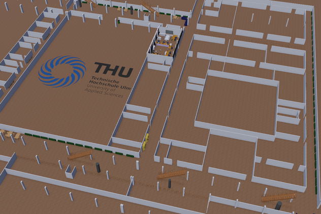
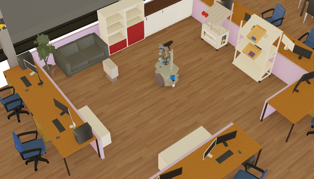
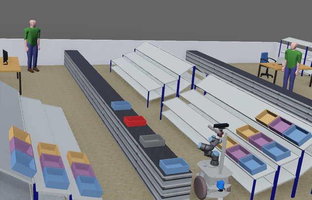
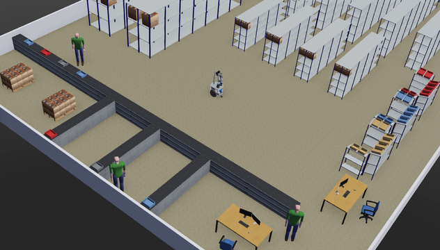
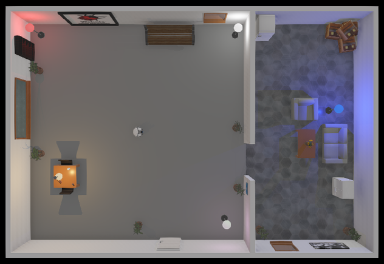
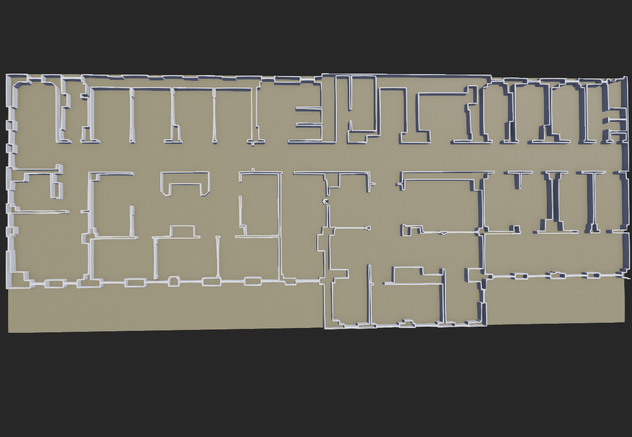
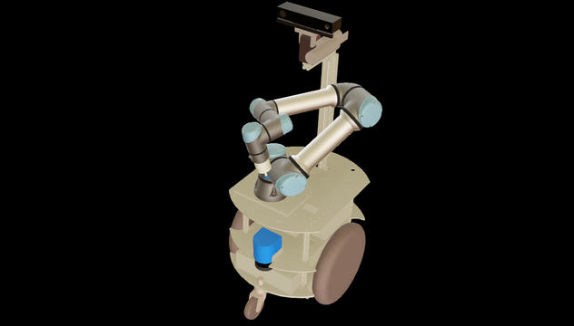

# Webots

Environments: 
* THU Ulm Campus

* Service Robotics Lab THU Ulm

* Larry Production Logistic

* Larry Intralogistic

* Home

* Hospital

Scenarios:

- Laser Obstacle Avoid
- Navigation (with Robotino, Pioneer, Tiago, Larry)
- Conveyor Belt Intralogistic
- Order Picking

Types of movement:
- differential drive with 2 wheels (Pioneer, Tiago)
- omnidirectional drive with 3 omni wheels (Robotino)
- omnidirectional drive with 4 mecanum wheels (Kuka YouBot)  

Robots:

* [Robotino3](https://cyberbotics.com/doc/guide/robotino3)
* [Pioneer3DX](https://cyberbotics.com/doc/guide/pioneer-3dx)
* [Tiago](https://cyberbotics.com/doc/guide/tiago-iron)
* Larry (made by THU Ulm, based on Segway RMP 50)

Webots is a free and open-source 3D robot simulator. Excellent documentation about webots can be found at [cyberbotics.com](https://cyberbotics.com/).

